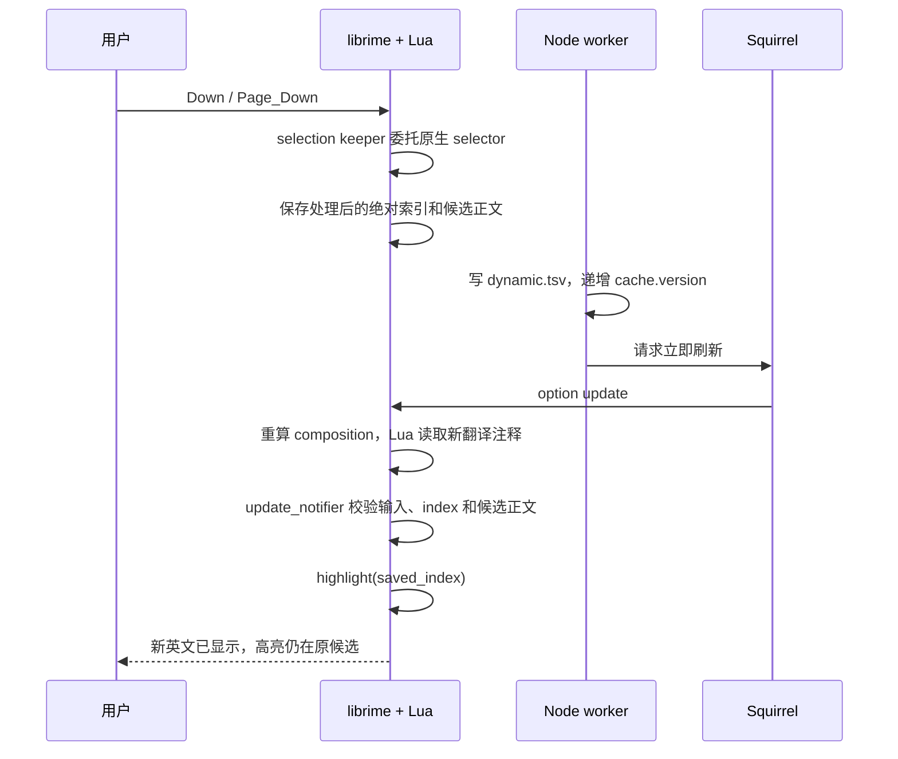

# AI 刷新时保留候选位置规格

状态：已实现，待真实输入交互验收
更新时间：2026-08-26

## 1. 问题

Node.js worker 在新翻译写入 `dynamic.tsv` 并更新 `cache.version` 后，会用 Squirrel 的
`--nascii` 通知触发当前 composition 重算。这样 AI 英文可以立即出现，但 librime 在 option
更新时调用 `RefreshNonConfirmedComposition()`，活动 segment 会重新生成，已经通过方向键
移动的高亮可能回到第一个候选。

不接受以下规避方案：

- 等到继续输入、退格或下一次输入时才显示 AI 翻译。
- 刷新前强制提交当前候选。
- 刷新后无条件选择旧 index，而不验证候选身份。

## 2. 目标与非目标

### 目标

- AI 翻译完成后立即刷新当前候选窗。
- 用户不按任何新键时，刷新前后高亮同一个中文候选。
- 支持跨页位置；`Page_Down` 后也必须回到原来的页和页内位置。
- 输入已变化或候选已变化时安全降级，不误选候选。
- 多次翻译完成导致连续刷新时仍保持最新的用户选择。

### 非目标

- 不改变候选正文、顺序或词频。
- 不让 AI 选择中文候选。
- 不在本规格中接入万象。
- 不改变 Windows 当前“下一次候选重算读取缓存”的平台行为。

## 3. 关键事实

librime 的活动 `Segment` 暴露 `selected_index`，它是候选列表中的绝对索引。页码和页内位置
可以由它派生：

```text
page_no       = floor(selected_index / page_size)
index_in_page = selected_index % page_size
```

因此实现只保存一个绝对索引，避免页码和 index 分别更新时产生不一致。

librime 的方向键选择有一个关键差异：`Context::Select()` 会发 `select_notifier`，但 `Down`
等方向键走的是 `Context::Highlight()`，后者只发 `update_notifier`。因此不能依靠
`select_notifier` 保存方向键位置。librime-lua 同时暴露：

- `Component.Processor(..., "selector")`
- `context.select_notifier`
- `context.update_notifier`
- `context:highlight(index)`
- `context.composition:back().selected_index`
- `segment:get_candidate_at(index)`

这些接口允许状态完全保存在 Squirrel 内的当前 Rime session。Node.js sidecar 仍只负责缓存和
发出刷新请求，不读取或修改候选选择。

参考实现接口：

- [librime Context](https://github.com/rime/librime/blob/master/src/rime/context.h)
- [librime engine option 更新流程](https://github.com/rime/librime/blob/master/src/rime/engine.cc)
- [librime-lua 类型绑定](https://github.com/hchunhui/librime-lua/blob/master/src/types.cc)

## 4. 状态模型

每个 Rime context 最多保存一份快照：

```lua
SelectionSnapshot = {
  input = "fayige",
  caret_pos = 7,
  selected_index = 6,
  candidate_text = "发一个",
}
```

另有一个只在恢复调用期间为真的 `restoring` 标志，用于避免 notifier 回调重入。

快照属于当前 composition，不写入磁盘，也不跨应用、session 或方案保留。

## 5. 状态转换

### 5.1 保存

selection keeper 位于 `smart_enter` 之后、schema 原生 `selector` 之前。收到候选导航键且
context 正在 composing、存在菜单和活动 segment 时：

1. 把按键交给另一个原生 `selector` processor 实例处理。
2. 原生 selector 接受该键后，读取 `context.input` 和 `context.caret_pos`。
3. 读取活动 segment 处理后的 `selected_index`。
4. 读取该 index 对应的候选正文。
5. 原子替换内存快照并返回 `kAccepted`，避免 schema 中后续的 selector 再处理一次。

原生 `Highlight()` 会同步发出一次 `update_notifier`；委托导航期间用 `navigating` 标志暂停恢复，
等 selector 返回后再保存最终位置。这样分页、布局和边界行为都继续由 librime 决定。

`select_notifier` 仍作为非方向键选择路径的补充，但不是方向键快照的状态来源。

选择第一项也可以保存；不能用“index 大于 0”判断用户是否操作过。

### 5.2 恢复

`update_notifier` 在 composition 重算后触发时，按以下顺序判断：

1. 当前不是 composing 或没有菜单：清空快照并退出。
2. `context.input` 或 `caret_pos` 与快照不同：清空快照并退出。
3. 当前活动 segment 不存在：清空快照并退出。
4. 保存的 index 超出当前候选数量：不恢复。
5. 该 index 的候选正文与 `candidate_text` 不同：不恢复。
6. 当前已经是该 index：无需调用 `highlight`。
7. 设置 `restoring = true`，调用 `context:highlight(selected_index)`，随后恢复为 `false`。

只有第 7 步会改变高亮。恢复成功后保留快照，以便同一 composition 的下一次 AI 刷新继续使用。

### 5.3 清空

发生以下任一事件时清空：

- commit
- abort（由 composition 关闭或下一次 input 校验清理；librime-lua 当前未公开 `abort_notifier`）
- 输入编码变化
- caret 位置变化
- 菜单或活动 segment 消失
- schema / session 生命周期结束

组件 `fini` 必须断开所有 notifier connection。

## 6. 时序



如果用户在 worker 返回前继续输入，`input` 校验失败，旧快照不会应用到新候选列表。

## 7. 并发与竞态

- worker 可以合并刷新请求，但每次刷新都以 Lua 进程内的最新选择快照为准。
- 用户在 AI 请求期间继续移动候选时，导航处理完成后覆盖旧快照。
- 多个候选分别完成导致连续刷新时，第一次恢复产生的高亮仍会被后续快照记录；不得退回更旧位置。
- `highlight()` 触发的选择通知必须受 `restoring` 保护，不能形成无限回调。
- 翻译 filter 只改 comment，正常情况下候选正文和顺序不变；候选正文校验仍是必须的安全保护。

## 8. 首选实现与后备实现

### 已采用：独立 Lua selection keeper

已新增 `rime/lua/selection_keeper.lua`，只管理导航委托、快照和 notifier，不与翻译网络、
缓存读取或 `smart_enter` 的 Return 行为混在一起。组件放在 `smart_enter` 之后和 schema 原生
`selector` 之前；只消费原生 selector 已接受的候选导航键，其他按键保持 `kNoop`。

代码全部留在本项目内，不需要维护 Squirrel fork，并且状态天然属于正确的 Rime session。
Engine 在初始化 Lua components 之前已经订阅 `update_notifier`；selection keeper 使用后注册的
未分组 callback，因此恢复发生在 Engine 完成 Compose 之后。部署前还核对了当前安装的
`librime-lua.dylib`，所需的 `Component.Processor`、`process_key_event`、`selected_index`、
`get_candidate_at`、`update_notifier` 与 `highlight` 均存在。

### 后备：在 Squirrel 内快照并恢复

如果 notifier 顺序无法稳定保证，则为 Squirrel 增加专用刷新通知。在活动 controller 内调用
`get_context` 保存 `page_no`、`page_size` 和 `highlighted_candidate_index`，重算后通过
`highlight_candidate` 恢复绝对索引。该方案更直接，但需要维护、构建和分发自定义 Squirrel，
因此不作为第一选择。

## 9. 验收标准

### 必须通过

1. 第一页按两次 `Down`，AI 返回后英文立即出现，高亮仍是同一候选。
2. `Page_Down` 到第二页并移动 index，AI 返回后页码、页内 index 和候选正文均不变。
3. 等待 AI 时继续输入一个编码，迟到刷新不能恢复旧 index。
4. 等待 AI 时按 Backspace，迟到刷新不能恢复旧 index。
5. 同一批次多个翻译先后完成并多次刷新，高亮始终不跳回第一项。
6. 保存的候选在重算后消失或换位时，不得高亮另一个正文。
7. 已提交或取消 composition 后，迟到刷新不得重新打开或改变候选窗。
8. 未移动候选时，立即刷新行为与当前版本一致。

### 回归要求

- `smart_enter`：方向键移动后 Return 仍确认当前候选。
- `Control+\``：仍由 VS Code 接收，不打开 Rime 方案选单。
- 翻译失败、无网络或无活动 Squirrel controller 时，中文输入不受影响。
- 不增加 Rime 按键线程上的文件写入或网络调用。

## 10. 可观测性

保留现有 `candidate_refresh_requested` / `candidate_refresh_failed`。以下细分事件作为后续
可选诊断，不纳入首版 selection keeper，避免在 Rime 按键线程新增磁盘写入：

- `candidate_selection_restored`
- `candidate_selection_restore_skipped`，原因限定为 `input_changed`、`candidate_changed`、
  `index_out_of_range` 或 `composition_closed`

这些事件用于验证稳定性，不作为恢复逻辑的状态来源。
