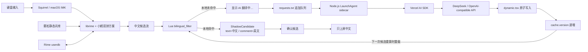

# 理解这套 Rime + DeepSeek 双语输入法

> 面向有工程经验的读者：从 Rime 的候选生成、词库与用户词频，到 Lua
> 过滤器、CC-CEDICT、DeepSeek sidecar、缓存一致性与运行维护。

## 0. 一句话心智模型

这不是一套从零实现的输入法，而是在成熟中文输入法链路旁边增加了一条异步英文注释链路：

- 鼠须管（Squirrel）和 librime 负责把小鹤双拼编码变成中文候选，并学习你的中文选词习惯。
- Lua filter 保持候选正文不变，只给候选的 `comment` 字段附加英文。
- 本地词典负责大多数即时翻译。
- 本地没有翻译时，Node.js sidecar 才通过 Vercel AI SDK 调用 DeepSeek，并把结果持久化为下一次可即时命中的缓存。

因此它更准确的名字是：**带异步 AI 缓存预热能力的 Rime 候选注释系统**。

## 1. 系统边界

这套系统同时维护两个互相独立的学习闭环：

| 闭环 | 输入 | 输出 | 改变什么 | 不改变什么 |
| --- | --- | --- | --- | --- |
| Rime 用户词典 | 你实际确认的中文候选 | `*.userdb/` 中的使用习惯 | 中文候选排序、自造词 | 英文翻译 |
| 双语翻译缓存 | Lua 观察到的缓存未命中候选 | `dynamic.tsv` | 候选旁的英文注释 | 中文候选正文和排序 |

这是理解整个项目最重要的分界：**Rime 学习“你想打哪个中文”，DeepSeek 缓存学习“这个中文怎样显示英文”**。

项目明确不做以下事情：

- 不让网络请求阻塞输入法按键线程。
- 不把英文拼接进候选正文。
- 不在 Lua 或 YAML 中保存 API Key。
- 不让 AI 决定中文候选排序。
- 不把每次按键产生的所有中间候选永久翻译一遍。

## 2. 端到端架构



架构上有三个进程边界：

1. macOS 应用通过输入法框架与 Squirrel 交互。
2. Squirrel 内部运行 librime 和 Lua，负责同步、低延迟的候选处理。
3. 独立 Node.js 进程负责网络、模型调用与磁盘缓存。

把网络隔离到 sidecar 是核心设计决策。输入法属于强交互、低延迟路径；即使 API 超时、限流或断网，中文输入也必须继续可用。

## 3. Rime 基础：从编码到上屏

### 3.1 四个不要混淆的对象

以输入 `fayige` 为例：

| 对象 | 示例 | 所属阶段 |
| --- | --- | --- |
| 原始编码（raw input/code） | `fayige` | 键盘与拼音解析 |
| 组合态（composition） | 尚未确认的输入区 | Rime 上下文 |
| 候选正文（candidate.text） | `发一个` | 中文候选生成 |
| 候选注释（candidate.comment） | `AI · send one` | Lua 展示增强 |

确认候选时，客户端接收到的是 `candidate.text`，不是视觉上看到的整行文本。

Lua 使用 `ShadowCandidate` 创建一个外观增强候选：

```text
text    = 发一个
comment = AI · send one
```

所以按空格或数字键后只会上屏 `发一个`。英文只是候选 UI 的元数据，不进入正文。

### 3.2 小鹤双拼与雾凇分别负责什么

小鹤双拼首先是一套编码映射：它定义按键序列如何表达声母、韵母。它本身并不等于词库。

雾凇拼音提供中文词条、读音、基础权重、语言模型和输入方案配置。当前项目把
`vendor/rime-ice` 部署到 `~/Library/Rime`，并选择 `double_pinyin_flypy` 方案。

可以把两者理解成：

```text
小鹤双拼：如何描述发音
雾凇词库：这个发音可能对应哪些中文，以及初始排序
Rime userdb：你本人通常选择哪个中文
```

### 3.3 静态词库和用户词典

Rime 部署时会把 YAML 词典编译成适合查询的二进制结构，例如 `*.table.bin`、
`*.prism.bin`。这些属于静态基线。

实际使用中，Rime 还会在 `~/Library/Rime/<词典名>.userdb/` 保存用户词典。它记录使用习惯和用户词条，并参与候选质量计算。长期使用后，常选词会更符合个人习惯。

这里不应把 userdb 简化成“一个纯计数器”。候选最终排序来自静态词频、语言模型、编码匹配、用户词典质量等多种信号。当前项目没有改写 librime 的排序算法，而是完整保留它的学习能力。

实用结论：

- 不要为了修改几个英文翻译而删除 `*.userdb/`；两者无关。
- 重新部署 YAML 通常不会抹掉 userdb。
- 换设备时，应把 Rime 用户词典快照和本项目的 `dynamic.tsv` 都纳入备份；它们分别保存两类学习结果。

## 4. 三层英文数据

英文注释不是从雾凇中文词库直接得到的，而是由三层翻译数据合并而成。

### 4.1 数据层与优先级

Lua 和 Node.js 使用相同的覆盖顺序：

```text
CC-CEDICT  <  seed.tsv  <  dynamic.tsv
```

后加载的同名中文覆盖前面的英文。

| 文件 | 角色 | 生成方式 | 典型内容 |
| --- | --- | --- | --- |
| `cedict.tsv` | 大规模基础中英词典 | `pnpm import:cedict` | `苹果 → apple` |
| `seed.tsv` | 人工／预生成覆盖层 | 随项目附带或 `pnpm seed` | 高频表达的精选翻译 |
| `dynamic.tsv` | AI 动态缓存与最终覆盖层 | sidecar 自动写入，可人工修订 | 新词、短语、句子 |

当前机器合并后约有 12 万条可即时命中的翻译。精确数字会随 AI 缓存增长，可运行：

```bash
pnpm status
```

### 4.2 为什么选择 CC-CEDICT

CC-CEDICT 是社区维护的中英词典，适合作为“中文词头到英文释义”的基础数据。导入器会：

1. 读取简体中文词头。
2. 排除分类词、异体字跳转、台湾读音等不适合作候选注释的释义。
3. 在多个释义中选择一个较简洁的定义。
4. 把单条英文截断到 120 个字符。
5. 生成纯文本 TSV，便于 Lua 快速加载。

它是词典，不是上下文翻译器。因此 `法医` 可能显示多个词典义项，而完整短语更适合交给 AI。

CC-CEDICT 数据遵循 CC BY-SA 4.0，归属信息见项目根目录的
`THIRD_PARTY_NOTICES.md`。

### 4.3 为什么动态缓存优先级最高

`dynamic.tsv` 的高优先级带来两个能力：

- AI 可为词典没有的短语补齐翻译。
- 用户可以人工修订某一行，把不满意的机器翻译覆盖掉。

worker 会把 dynamic Map 常驻内存，因此不要在它运行时直接编辑后长期放置：下一次 AI 写回可能用内存旧值覆盖人工修改。安全流程是先修改文件，再运行 `pnpm install:rime` 重启 sidecar 并更新 `cache.version`；下一次候选重算会加载新值。

TSV 格式刻意保持简单：

```text
发一个\tsend one
我的帽子\tmy hat
```

上面的示意用 `\t` 表示分隔位置；实际文件使用真实 Tab，不是两个字符 `\` 和 `t`。sidecar 使用“临时文件 + rename”原子替换，避免 Lua 在写入一半时读到损坏文件。

## 5. Lua filter：输入法内的同步快路径

实现位于 `rime/lua/bilingual_filter.lua`。

### 5.1 命中路径

Lua 初始化时读取三层 TSV；其中大型 `cedict.tsv` 在一个 Rime 会话内只加载一次。每个候选经过 filter 时：

1. 只处理前 `bilingual/max_candidates` 个候选，当前为 5。
2. 在内存 Map 中按中文正文查英文。
3. 命中时构造 `ShadowCandidate`。
4. 如果命中来自 `dynamic.tsv`，显示 `AI ·` 前缀。
5. 始终保留原候选 `text`，因此上屏只有中文。

### 5.2 未命中路径

前 5 个候选中有汉字且未命中缓存时：

1. 候选立即显示 `AI 翻译中…`。
2. 中文候选仍可立即确认，不等待模型。
3. 中文文本追加到 `requests.txt`。
4. 同一 Lua 会话用 `env.pending` 避免重复追加相同候选。

### 5.3 缓存失效协议

sidecar 每次成功写入 `dynamic.tsv` 后，会更新 `cache.version`。Lua 在候选过滤时读取这个轻量版本文件：

- 版本未变：继续使用内存 Map，不读取任何翻译 TSV。
- 版本变化：只重读很小的 `seed.tsv` 与 `dynamic.tsv`。
- `cedict.tsv`：在当前 Rime 会话保持为不可变基线，避免每批 AI 写回都同步解析约 12 万行。

查找时按 `dynamic → seed → dictionary` 顺序访问三个 Map，仍然保持原有覆盖语义。基准测试中，AI 写回后的同步重载由约 94 ms 降至约 0.17 ms；网络调用本身始终位于独立 sidecar，不占用输入线程。

### 5.4 为什么候选不会自动原地刷新

Lua 在 Squirrel 内执行，Node.js 在另一个进程执行。sidecar 完成网络请求后只能写磁盘，不能安全地回调正在运行的 Rime candidate pipeline。

因此第一次通常经历：

```text
第一次候选重算：发一个  AI 翻译中…
DeepSeek 完成：   dynamic.tsv 已有 send one
下一次候选重算：发一个  AI · send one
```

“下一次候选重算”可以来自继续输入、增删一个拼音字符，或重新输入。它不是网络没有调用，而是 UI 没有跨进程主动刷新。

## 6. Node.js sidecar：异步慢路径

sidecar 由 `src/worker.ts` 实现，通过 macOS LaunchAgent
`com.local.rime-bilingual` 常驻运行。

### 6.1 为什么使用追加队列

Lua 只执行一次追加写，不需要锁数据库，也不需要建立 socket。`requests.txt` 是 append-only 日志，`.queue-offset` 是已经消费到的字节偏移。

读取算法只接受以换行结尾的完整记录，避免并发读取半行。它还会：

- 跳过三层缓存中已经存在的中文。
- 对未消费窗口内的重复候选去重。
- 保留最近出现顺序。
- 只取最新 `batchSize` 条，当前为 5。

队列行数不等于真实积压量。大量行只是打字过程留下的中间候选；sidecar 有意折叠陈旧状态，而不是按 FIFO 把每个中间状态都付费翻译。

### 6.2 防抖与“最新优先”

worker 看到候选后等待 800 ms，再次检查队列。如果期间仍有按键产生新候选，就放弃旧窗口并重新选择最新 5 条。

这使系统更接近输入意图：

```text
ni → 你/呢/泥
niha → 你好/拟好/…
nihao → 你好/你号/…
```

通常没有价值为每个中间状态调用模型；用户停顿后的候选更值得翻译。

代价是：如果某个短语只短暂出现，随后被更多输入覆盖，它可能不会进入 AI 缓存。重新输入并停顿即可再次触发。

### 6.3 Vercel AI SDK 调用

当前依赖版本：

```text
ai                            7.0.79
@ai-sdk/openai-compatible     3.0.37
@ai-sdk/deepseek              3.0.32
```

provider 选择逻辑：

```text
存在 OPENAI_BASE_URL
  → createOpenAICompatible(...)(MASTRA_CHAT_MODEL)
否则
  → createDeepSeek(...)(DEEPSEEK_MODEL)
```

翻译使用 `generateText` 与 `Output.object`，并通过 Zod 约束输出：

```ts
{
  translations: Array<{
    source: string;
    english: string;
  }>;
}
```

这比解析自由文本稳定：模型必须返回每个原始中文及对应英文；worker 还会验证返回数量、过滤未知 `source`、清理换行和括号，并限制单条长度。

当前兼容接口使用：

- 批量大小：5。
- 防抖：800 ms。
- 超时：30 秒。
- 最大输出 token：至少 2048。

提高 token 上限不是为了生成长答案，而是因为某些推理模型会把内部推理计入输出预算；预算过低可能得到 `NoOutputGeneratedError`。

### 6.4 成功、失败和重试语义

只有当模型返回了整批候选的有效翻译时，worker 才会：

1. 合并到内存中的 `dynamic` 与 `known` Map。
2. 原子写回 `dynamic.tsv`。
3. 更新 `cache.version`。
4. 提交 `.queue-offset`。

如果超时、模型漏项或结构化输出校验失败，worker 默认进行最多 3 次重试，间隔为 2 秒、4 秒、8 秒。仍然失败时，该批次会写入 `failed-requests.jsonl`，随后推进 offset，避免坏批次永久阻塞队列或无限消耗 API。中文输入本身不受影响。

## 7. 长句翻译的真实边界

sidecar 翻译的是 **Rime 产生的候选正文**，不是原始拼音，也不是当前应用中的整段上下文。

这意味着：

- 如果 Rime 给出完整句子候选，AI 会翻译完整句子。
- 如果 Rime 只给出 `发一个`、`长一点` 等分段候选，AI 只能分别翻译这些片段。
- AI 看不到光标前后的文章，也不知道具体语域。
- 一个词典词头可能有多个义项，而候选注释空间有限。

这不是模型能力问题，而是数据边界问题。要实现真正的“上下文英语学习助手”，需要在用户确认候选后获取更长上下文，或维护一个句子级 composition buffer。那会引入隐私、应用兼容性、延迟和 macOS 辅助功能权限等新成本，不属于当前原型范围。

## 8. 三种“中英文切换”

这也是最容易混淆的一组概念。

### 8.0 连续中英混输与自动空格

`mixed_input_translator.lua` 对连续输入做保守切分：中文前缀必须精确命中当前小鹤双拼词典，英文后缀必须精确命中 `melt_eng`。它优先使用最长中文前缀，因此 `dakdapp` 可产生 `打开 APP`；无法同时精确命中的输入不会生成混输候选。该功能由 `Control+Shift+M` 切换。

`mixed_spacing_filter.lua` 在 CJK 字符和 ASCII 字母数字之间插入一个半角空格，同时参考 Rime 的上一条提交历史处理分两次上屏的 `打开` + `APP`。它不会读取宿主应用的全文或光标位置，所以移动光标、粘贴或从其他输入法切回后，历史边界只能作为启发式信息。该功能由 `Control+Shift+S` 切换。

### 8.1 双语注释开关

`bilingual_output` 只控制候选旁是否显示英文、是否创建 AI 请求：

```text
Control + Shift + B
```

- `中英`：显示本地英文；未命中时调用 AI。
- `中文`：Lua 原样透传候选，不创建翻译请求。

处理敏感文本时应切到 `中文`，避免候选被发送给远程 API。

### 8.2 Rime 内部 ASCII 模式

`Caps Lock / 中英`、左 Shift、右 Shift 当前都配置为 `commit_code`：

- 存在 composition：先提交原始编码，例如 `fayige`，再切到英文模式。
- 不存在 composition：直接切换中文／英文模式。

`commit_code` 与 `commit_text` 不同：前者提交原始编码，后者确认当前中文候选。

### 8.3 Return 的上下文语义

雾凇原始方案把 `Return` 固定为 `commit_raw_input`。当前项目在 `key_binder` 之前插入 `smart_enter` processor，维护一个 composition 级状态：

- 没有使用过上下／翻页导航键：`Return` 继续交给原方案，上屏原始拼音。
- 使用导航键移动过高亮项：`Return` 确认并提交当前候选。
- composition 结束：状态重置，不影响下一次输入。

它不是简单地把 Return 映射成空格；后者会让“首次输入后直接回车上屏拼音”的能力消失。

### 8.4 macOS 系统输入源切换

从“鼠须管”切到“ABC”属于 macOS 输入源切换，不等同于 Rime 内部 ASCII 模式。

当前机器安装了官方 Squirrel Nightly。它与稳定版界面几乎一致，主要增加了 macOS 26 下程序化切换输入源时清理遗留 composition 的兜底逻辑。当前机器是 macOS 15，因此日常使用差异很小。

## 9. 文件与部署模型

### 9.1 项目源文件

```text
rime-bilingual-ime/
├── rime/
│   ├── default.custom.yaml                 # 全局按键、方案列表、页大小
│   ├── double_pinyin_flypy.custom.yaml     # 双语开关和 Lua filter
│   ├── lua/bilingual_filter.lua            # 候选增强与请求入队
│   ├── lua/smart_enter.lua                 # 导航后 Return 确认候选
│   └── bilingual/seed.tsv                  # 初始翻译覆盖层
├── src/
│   ├── config.ts                           # 环境变量和路径
│   ├── translator.ts                       # AI SDK + 结构化输出
│   ├── worker.ts                           # 队列消费循环
│   ├── store.ts                            # TSV、原子写、offset
│   ├── import-cedict.ts                    # CC-CEDICT 导入
│   ├── seed.ts                             # 高频词 AI 预生成
│   ├── install-rime.ts                     # 部署与 LaunchAgent
│   └── status.ts                           # 状态摘要
├── .env                                    # 本机密钥；被 gitignore
└── THIRD_PARTY_NOTICES.md                  # 第三方数据许可
```

### 9.2 运行时文件

```text
~/Library/Rime/
├── build/                                  # Rime 部署后的编译产物
├── *.userdb/                               # Rime 中文选词学习结果
├── lua/bilingual_filter.lua                # 已部署 Lua
└── bilingual/
    ├── cedict.tsv                          # CC-CEDICT 导入结果
    ├── seed.tsv                            # 初始/预生成翻译
    ├── dynamic.tsv                         # AI 动态缓存
    ├── requests.txt                        # 追加请求日志
    ├── .queue-offset                       # 消费字节位置
    ├── cache.version                       # Lua 缓存失效版本
    ├── worker.log                          # 成功与启动日志
    └── worker.error.log                    # 超时、模型或解析错误
```

源文件和运行时文件必须区分。修改项目中的 `rime/*.yaml` 或 Lua 后，需要重新执行安装／部署，不能只看源文件判断是否已经生效。

## 10. 常用操作

所有命令都在项目目录执行：

```bash
cd /Users/wangwenbo/Desktop/rime-bilingual-ime
```

### 状态、测试与构建

```bash
pnpm status
pnpm check
pnpm test
pnpm build
```

### 部署 Rime 和重启 sidecar

```bash
pnpm install:rime
"/Library/Input Methods/Squirrel.app/Contents/MacOS/Squirrel" --reload
```

### 更新第三方中英词典

```bash
pnpm import:cedict
"/Library/Input Methods/Squirrel.app/Contents/MacOS/Squirrel" --reload
```

### 用 AI 预生成更多高频词翻译

```bash
pnpm seed -- --count 2000
```

### 观察运行日志

```bash
tail -f ~/Library/Rime/bilingual/worker.log
tail -f ~/Library/Rime/bilingual/worker.error.log
```

### 检查 LaunchAgent

```bash
launchctl print "gui/$(id -u)/com.local.rime-bilingual"
```

## 11. 故障诊断

| 现象 | 最可能原因 | 检查方式 | 处理方式 |
| --- | --- | --- | --- |
| 所有候选都没有英文 | 双语开关关闭或 Lua 未部署 | 看方案状态、检查已部署 Lua | 按 `Control+Shift+B`；重新部署 |
| 只有常见词有英文 | CC-CEDICT 命中，AI 尚未完成 | 看是否显示 `AI 翻译中…` | 停顿后增删字符或重新输入 |
| 显示 `AI 翻译中…` 很久 | API 超时、Key/模型错误 | `worker.error.log` | 检查 `.env`、接口和超时 |
| 显示 `AI · English` | 命中 `dynamic.tsv` | 查 `dynamic.tsv` | 正常的 AI 缓存结果 |
| 英文释义很长、像词典 | CC-CEDICT 多义项 | 查 `cedict.tsv` | 修订 `dynamic.tsv`，随后运行 `pnpm install:rime` |
| 长句只翻译成短片段 | Rime 只生成了片段候选 | 观察候选正文 | 继续输入到完整候选，或接受当前架构边界 |
| 输入过程中偶发顿挫 | 大型词典被反复同步解析 | 检查是否为旧版 Lua | 部署当前优化版；CC-CEDICT 每会话只加载一次 |
| 候选窗口过宽 | 英文词典释义过长 | 观察最长 comment | 调小 `bilingual/max_comment_length` |
| 空格上屏了英文 | 候选正文被错误改写 | 检查 Lua 是否保留 `candidate.text` | 恢复 `ShadowCandidate(..., text, comment)` |
| 移动候选后 Return 仍上屏拼音 | `smart_enter` 未部署或 processor 顺序错误 | 检查构建后的 processors | 确保它位于 `key_binder` 和 `express_editor` 之前 |
| 中英键清空拼音 | `Caps_Lock` 使用了 `clear` | 检查 `build/default.yaml` | 设置为 `commit_code` 并部署 |
| 队列行数很大 | append-only 日志记录中间状态 | `pnpm status` | 不等于待付费请求；worker 会折叠最新状态 |

一个可靠的排查顺序：

```text
候选是否有 AI 翻译中…
  ↓ 有：Lua 工作，继续查 sidecar
LaunchAgent 是否 running
  ↓ 是：查 worker.error.log
dynamic.tsv 是否出现中文词条
  ↓ 有：缓存已写，触发一次候选重算
候选是否出现 AI ·
```

## 12. 配置旋钮

`.env` 支持：

| 环境变量 | 默认值 | 含义 |
| --- | ---: | --- |
| `RIME_BILINGUAL_BATCH_SIZE` | 5 | 每次最多翻译的最新候选数 |
| `RIME_BILINGUAL_POLL_MS` | 250 | worker 空闲轮询周期 |
| `RIME_BILINGUAL_DEBOUNCE_MS` | 800 | 停止输入后的防抖时间 |
| `RIME_BILINGUAL_TIMEOUT_MS` | 兼容接口 30000 | 单次模型请求超时 |
| `RIME_BILINGUAL_MAX_OUTPUT_TOKENS` | 兼容接口 2048 | 结构化输出预算 |
| `RIME_BILINGUAL_MAX_RETRIES` | 3 | 初次失败后的最大重试次数；0 表示不重试 |
| `RIME_BILINGUAL_RETRY_BASE_MS` | 2000 | 指数退避的初始等待时间 |
| `RIME_BILINGUAL_QUEUE_MAX_BYTES` | 1048576 | 已完全消费的请求队列压缩阈值 |
| `RIME_BILINGUAL_LOG_MAX_BYTES` | 1048576 | 单个 worker／死信日志的轮转阈值 |
| `RIME_BILINGUAL_DATA_DIR` | `~/Library/Rime/bilingual` | 运行时数据目录 |

候选显示数量由 `rime/double_pinyin_flypy.custom.yaml` 中的
`bilingual/max_candidates` 控制。增加它会提高 UI 密度、队列写入量和潜在 API 成本。

同一文件中的 `bilingual/max_comment_length` 控制新增英文注释的最大 Unicode 字符数，当前为 42。截断只影响候选 UI，TSV 中仍保存完整翻译。

## 13. 隐私、安全与许可

### 13.1 数据会去哪里

在 `中英` 模式下，前 5 个候选中的缓存未命中中文会被发送到当前配置的远程 API。它可能包含姓名、项目名或尚未提交的文本片段。

因此：

- 输入敏感内容前按 `Control+Shift+B` 切换到 `中文`。
- 不要把 API Key 写进 Lua、YAML、TSV 或日志。
- `.env` 已被 `.gitignore` 排除，但曾经在聊天或终端暴露过的测试 Key 仍应撤销。
- `worker.log` 会在本机记录被缓存的中文候选；备份日志时也应考虑隐私。

### 13.2 Nightly 风险

当前安装的官方 Squirrel Nightly 来自项目的 GitHub Release，但该 Nightly 包没有 Apple Developer ID Installer 签名，内层应用是无 Team ID 的自签名构建。稳定版安装包仍保留在 `.downloads/`，需要时可以回退。

### 13.3 数据许可

项目代码是 MIT；CC-CEDICT 派生数据保持 CC BY-SA 4.0。分发 `cedict.tsv` 或其派生物时必须保留相应归属与许可。

## 14. 当前设计的优点与债务

### 优点

- 输入主路径完全本地，不被网络拖慢。
- 英文与候选正文分离，上屏语义安全。
- 缓存是透明、可编辑、可备份的 TSV。
- CC-CEDICT 承担大多数低成本命中，DeepSeek 只处理长尾。
- Rime 原生 userdb 继续学习个人中文词频。
- 失败不会破坏中文输入。

### 技术债务

- sidecar 无法主动刷新已打开的候选菜单。
- CC-CEDICT 在 Rime 会话初始化时仍需全量解析；动态层增长很大后，TSV 全量写回也会逐渐昂贵。
- 一个 batch 中任意漏项仍会导致整批重试，但已受到重试上限和死信记录保护。
- 连续中英混输采用精确词典切分，尚不支持任意未登录英文、复杂产品名或上下文消歧。
- AI 只看到候选文本，没有上下文、语域和用户反馈信号。
- `dynamic.tsv` 同时承担“AI 结果”和“人工覆盖”，来源元数据比较粗。

## 15. 推荐的演进顺序

如果要把原型继续产品化，建议按以下优先级推进：

1. **队列可靠性**：进一步支持单条失败的部分提交和死信重放。
2. **缓存存储**：由 TSV 迁移到 SQLite，同时生成 Lua 可读取的只读快照。
3. **人工纠错**：提供一个编辑最近翻译、拉黑错误释义的轻量界面。
4. **语义元数据**：记录来源、模型、时间、置信度、人工确认状态。
5. **隐私策略**：允许按应用、关键词或候选长度禁止远程请求。
6. **上下文翻译**：在明确授权后引入句子级上下文，而不是盲目扩大模型输入。
7. **词频与翻译联动**：优先为 Rime userdb 中高频且未翻译的个人词条预热。

最后一项最符合这套系统的长期价值：不是无限扩大公共词库，而是让 AI 预算集中在**你真正经常输入、但公共词典覆盖不好的表达**上。

## 16. 参考资料

- [Rime 用户资料目录与 userdb](https://github.com/rime/home/wiki/UserData)
- [Rime 用户词典管理、快照与同步](https://github.com/rime/home/wiki/UserGuide)
- [Rime 输入方案与词典编译模型](https://github.com/rime/home/wiki/RimeWithSchemata)
- [librime UserDictionary 实现](https://github.com/rime/librime/blob/master/src/rime/dict/user_dictionary.cc)
- [librime ascii_composer 与 commit_code](https://github.com/rime/librime/blob/master/src/rime/gear/ascii_composer.cc)
- [Squirrel 程序化输入源切换修复 #1140](https://github.com/rime/squirrel/issues/1140)
- [CC-CEDICT](https://cc-cedict.org/)
- [Vercel AI SDK](https://ai-sdk.dev/docs)
